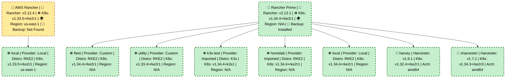

```mermaid
flowchart TD
    %% Rancher Architecture Topology

    SERVER_0("🏢 AWS Rancher | 🐂 Rancher: v2.12.4 | ☸️ K8s: v1.33.5+rke2r1 | 🌍 Region: us-east-1 | 💾 Backup: Not Found")
    style SERVER_0 fill:#FFEB9C,stroke:#9C5700,stroke-width:2px,stroke-dasharray: 5 5,color:#000
    SERVER_1("🏢 Rancher Prime | 🐂 Rancher: v2.13.1 | ☸️ K8s: v1.34.4+rke2r1 | 🌍 Region: N/A | 💾 Backup: Installed")
    style SERVER_1 fill:#C6EFCE,stroke:#006100,stroke-width:2px,stroke-dasharray: 5 5,color:#000

    DS_0("☸️ local | Provider: Local | Distro: RKE2 | K8s: v1.33.5+rke2r1 | Region: us-east-1")
    style DS_0 fill:#C6EFCE,stroke:#006100,stroke-width:2px,stroke-dasharray: 5 5,color:#000
    SERVER_0 --> DS_0
    DS_1("☸️ fleet | Provider: Custom | Distro: RKE2 | K8s: v1.34.4+rke2r1 | Region: N/A")
    style DS_1 fill:#C6EFCE,stroke:#006100,stroke-width:2px,stroke-dasharray: 5 5,color:#000
    SERVER_1 --> DS_1
    DS_2("☸️ utility | Provider: Custom | Distro: RKE2 | K8s: v1.33.4+rke2r1 | Region: N/A")
    style DS_2 fill:#C6EFCE,stroke:#006100,stroke-width:2px,stroke-dasharray: 5 5,color:#000
    SERVER_1 --> DS_2
    DS_3("☸️ k3s-test | Provider: Imported | Distro: K3s | K8s: v1.34.4+k3s1 | Region: N/A")
    style DS_3 fill:#C6EFCE,stroke:#006100,stroke-width:2px,stroke-dasharray: 5 5,color:#000
    SERVER_1 --> DS_3
    DS_4("☸️ homelab | Provider: Imported | Distro: RKE2 | K8s: v1.34.4+rke2r1 | Region: N/A")
    style DS_4 fill:#C6EFCE,stroke:#006100,stroke-width:2px,stroke-dasharray: 5 5,color:#000
    SERVER_1 --> DS_4
    DS_5("☸️ local | Provider: Local | Distro: RKE2 | K8s: v1.34.4+rke2r1 | Region: N/A")
    style DS_5 fill:#C6EFCE,stroke:#006100,stroke-width:2px,stroke-dasharray: 5 5,color:#000
    SERVER_1 --> DS_5

    HV_0("🚜 harvey | Harvester: v1.6.1 | K8s: v1.32.4+rke2r1 | Arch: amd64")
    style HV_0 fill:#C6EFCE,stroke:#006100,stroke-width:2px,stroke-dasharray: 5 5,color:#000
    SERVER_1 --> HV_0
    HV_1("🚜 vharvester | Harvester: v1.7.1 | K8s: v1.34.3+rke2r3 | Arch: amd64")
    style HV_1 fill:#C6EFCE,stroke:#006100,stroke-width:2px,stroke-dasharray: 5 5,color:#000
    SERVER_1 --> HV_1
```