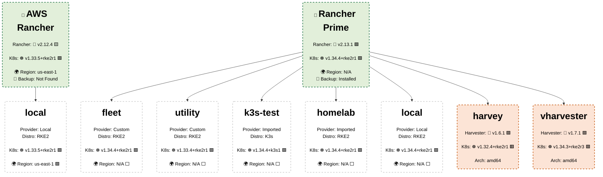

```mermaid
flowchart TD
    %% Rancher Architecture Topology

    SERVER_0("🏢 <b style='font-size: 2em;'>AWS Rancher</b><br><br>Rancher: 🐄 v2.12.4 🟨<br><br>K8s: ☸️ v1.33.5+rke2r1 🟩<br><br>🌍 Region: us-east-1<br>💾 Backup: Not Found")
    style SERVER_0 fill:#e2efda,stroke:#217346,stroke-width:2px,stroke-dasharray: 5 5,color:#000000
    SERVER_1("🏢 <b style='font-size: 2em;'>Rancher Prime</b><br><br>Rancher: 🐄 v2.13.1 🟩<br><br>K8s: ☸️ v1.34.4+rke2r1 🟩<br><br>🌍 Region: N/A<br>💾 Backup: Installed")
    style SERVER_1 fill:#e2efda,stroke:#217346,stroke-width:2px,stroke-dasharray: 5 5,color:#000000

    DS_0("<b style='font-size: 2em;'>local</b><br><br>Provider: Local<br>Distro: RKE2<br><br>K8s: ☸️ v1.33.5+rke2r1 🟩<br><br>🌍 Region: us-east-1 🟩")
    style DS_0 fill:#ffffff,stroke:#cccccc,stroke-width:2px,stroke-dasharray: 5 5,color:#000000
    SERVER_0 --> DS_0
    DS_1("<b style='font-size: 2em;'>fleet</b><br><br>Provider: Custom<br>Distro: RKE2<br><br>K8s: ☸️ v1.34.4+rke2r1 🟩<br><br>🌍 Region: N/A ⬜")
    style DS_1 fill:#ffffff,stroke:#cccccc,stroke-width:2px,stroke-dasharray: 5 5,color:#000000
    SERVER_1 --> DS_1
    DS_2("<b style='font-size: 2em;'>utility</b><br><br>Provider: Custom<br>Distro: RKE2<br><br>K8s: ☸️ v1.33.4+rke2r1 🟩<br><br>🌍 Region: N/A ⬜")
    style DS_2 fill:#ffffff,stroke:#cccccc,stroke-width:2px,stroke-dasharray: 5 5,color:#000000
    SERVER_1 --> DS_2
    DS_3("<b style='font-size: 2em;'>k3s-test</b><br><br>Provider: Imported<br>Distro: K3s<br><br>K8s: ☸️ v1.34.4+k3s1 🟩<br><br>🌍 Region: N/A ⬜")
    style DS_3 fill:#ffffff,stroke:#cccccc,stroke-width:2px,stroke-dasharray: 5 5,color:#000000
    SERVER_1 --> DS_3
    DS_4("<b style='font-size: 2em;'>homelab</b><br><br>Provider: Imported<br>Distro: RKE2<br><br>K8s: ☸️ v1.34.4+rke2r1 🟩<br><br>🌍 Region: N/A ⬜")
    style DS_4 fill:#ffffff,stroke:#cccccc,stroke-width:2px,stroke-dasharray: 5 5,color:#000000
    SERVER_1 --> DS_4
    DS_5("<b style='font-size: 2em;'>local</b><br><br>Provider: Local<br>Distro: RKE2<br><br>K8s: ☸️ v1.34.4+rke2r1 🟩<br><br>🌍 Region: N/A ⬜")
    style DS_5 fill:#ffffff,stroke:#cccccc,stroke-width:2px,stroke-dasharray: 5 5,color:#000000
    SERVER_1 --> DS_5

    HV_0("<b style='font-size: 2em;'>harvey</b><br><br>Harvester: 🚜 v1.6.1 🟩<br><br>K8s: ☸️ v1.32.4+rke2r1 🟥<br><br>Arch: amd64")
    style HV_0 fill:#fce4d6,stroke:#c65911,stroke-width:2px,stroke-dasharray: 5 5,color:#000000
    SERVER_1 --> HV_0
    HV_1("<b style='font-size: 2em;'>vharvester</b><br><br>Harvester: 🚜 v1.7.1 🟩<br><br>K8s: ☸️ v1.34.3+rke2r3 🟩<br><br>Arch: amd64")
    style HV_1 fill:#fce4d6,stroke:#c65911,stroke-width:2px,stroke-dasharray: 5 5,color:#000000
    SERVER_1 --> HV_1
```